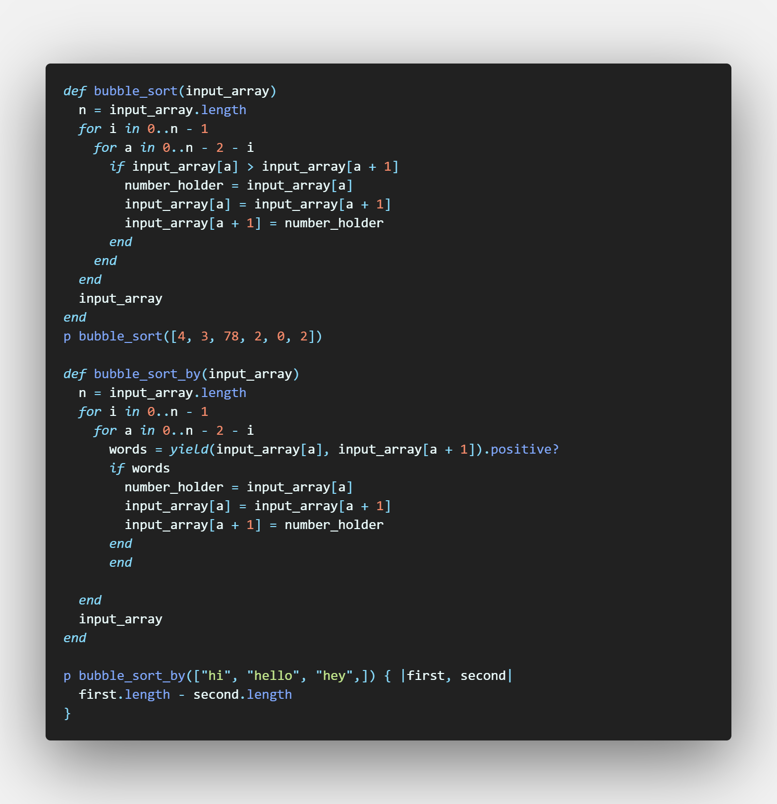

# bubble-sort

 First Ruby project fron the Microverse curriculum.
 In this project, we were asked to build a bubble sorting algorithm where each element is compared to the one next to it and they are swapped if the one on the left is larger than the one on the right. This continues until the array is eventually sorted.

## Built With

- RUBY

## 🤝 Contributing

Contributions, issues and feature requests are welcome! Start by:

- Forking the project
- Cloning the project to your local machine
- `cd` into the project directory
- Run `git checkout -b your-branch-name`
- Make your contributions
- Push your branch up to your forked repository
- Open a Pull Request with a detailed description to the development branch of the original project for a review

## Authors

👤 **Maurice Murangwa**

- Github: [@Morrism1](https://github.com/Morrism1)
- Twitter: [@MorrisMontana0](https://twitter.com/MorrisMontana0)
- Linkedin: [Maurice Murangwa](https://www.linkedin.com/in/murangwa-maurice-769549140/)

👤 **Luis Raul Figuerao Soto**

- Github: [@tacodtipe](https://github.com/tacodtripe)
- Twitter: [@raul_figueroa17](https://twitter.com/raul_figueroa17)
- Linkedin: [linkedin](https://www.linkedin.com/in/luis-raul-figueroa-soto-63411118a/)

## Show your support

Give a ⭐️ if you like this project!

## 📝 License

This project is [MIT](lic.url) licensed.
